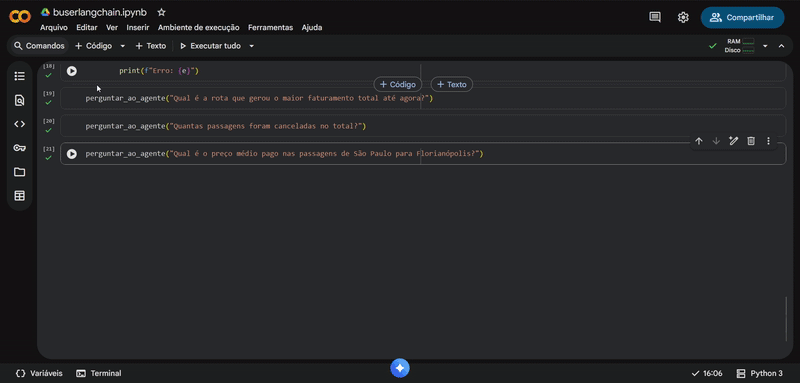

# 🚌 AI SQL Agent PoC

### Projeto
Faça perguntas em linguagem natural e receba respostas baseadas em dados reais.\
O agente é capaz de converter perguntas de negócio em queries SQL executáveis.\
O sistema utiliza o framework ReAct (Reason + Act) implementado pelo LangChain.

### Tech
* **Core:** Python
* **Orquestração:** LangChain
* **LLM:** GPT-3.5-turbo via API
* **Database:** SQLite

### Exemplos

